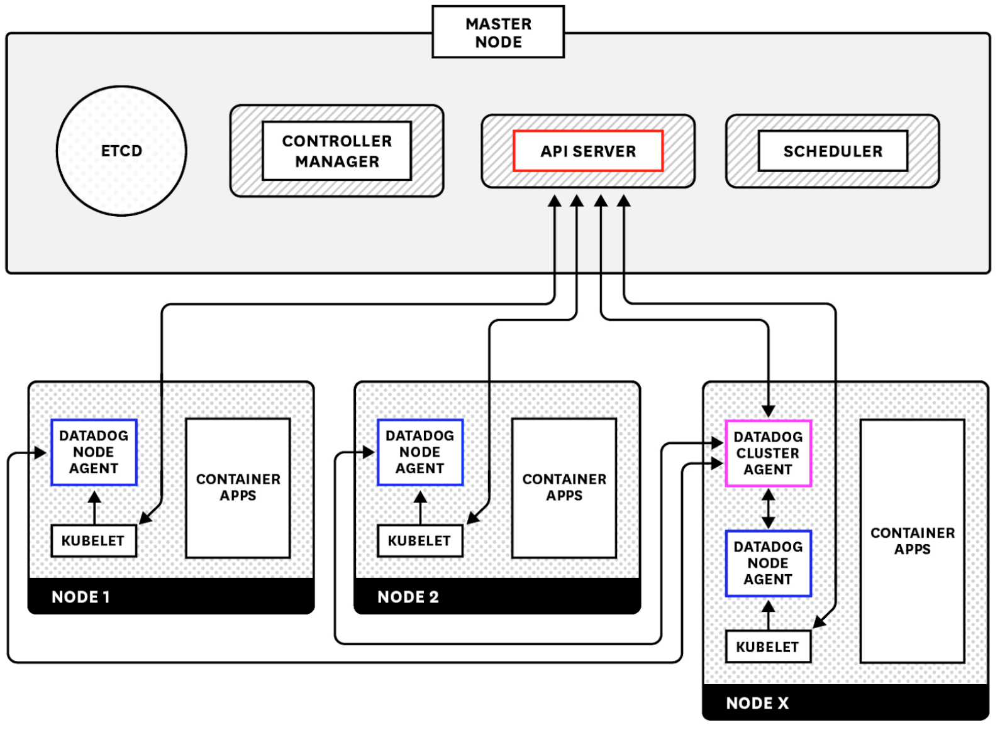

To practice different progressive delivery implementations in Kubernetes, we will be using a test e-commerce application that will be deployed in a Kubernetes cluster for you.

The e-commerce application is mainly a monolith frontend Rails applications, which talks to a couple of Python microservices (serving advertisements and discounts), and backed up by a Postgres database.

The first thing we will need to do before we start deploying new versions of our application is ensuring that we have the proper telemetry data.

We will deploy the Datadog Node Agent and the Cluster Agent in our Kubernetes cluster to start gathering metrics, logs and traces from our application and our cluster.

The Datadog Node Agent gathers metrics, logs and traces for all the pods that are running on a particular node as well as system metrics of the node itself. The Datadog Cluster Agent gathers metrics about the state of the Kubernetes API server.

In the first lab of this course, we will start by deploying the Datadog Agents and start watching what type of data we are getting on Datadog.
