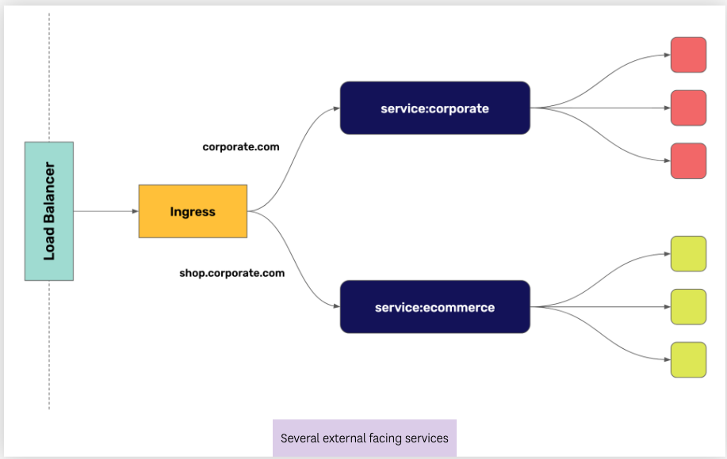
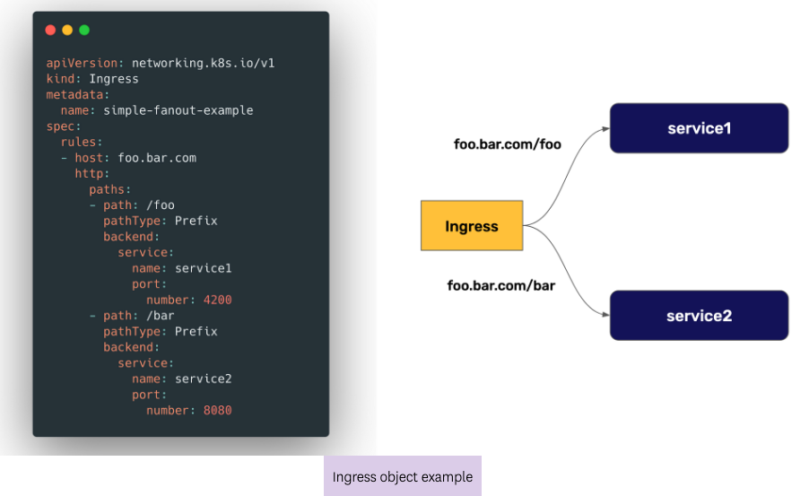
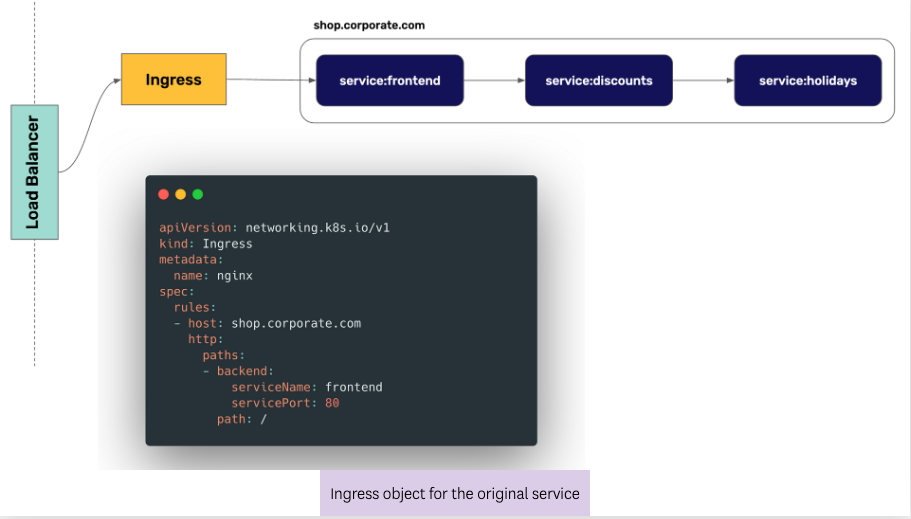
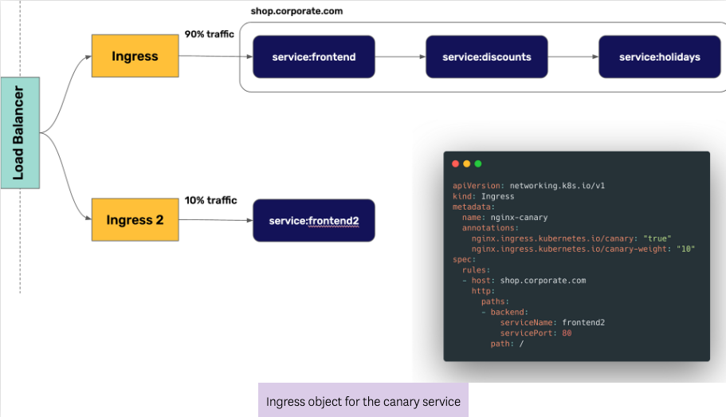
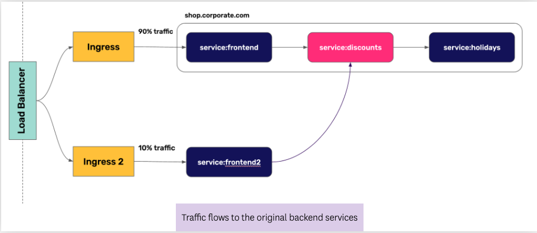
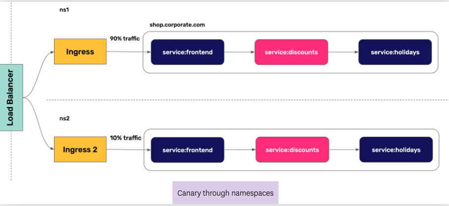

The second way in which we are going to implement Progressive Delivery in Kubernetes is by using the Ingress object. But first, let recall what the Ingress object does.

## The Ingress Object

Usually, getting external traffic into a Kubernetes cluster is done through a load balancer, like a public cloud load balancer. Once the external traffic gets into the cluster it can reach the external facing services. But what if we have several external facing services in our cluster? Do we need several load balancers? The way Kubernetes implement this is through the Ingress object.

The Ingress object allows splitting traffic based on the destination URL, or the URL path. In the below example, we split external traffic defining an Ingress object for it:

## Progressive Delivery Using Ingress
Even though the Ingress object doesn't have features to implement Progressive Delivery, the different implementations of the Ingress controller have their own implementations. In this course we are going to look at NGINX, as it is one of the most popular Ingress controllers for Kubernetes.

NGINX Ingress controllers implements Progressive Delivery through annotations on the canary Ingress. For the original service, we create a normal Ingress object:

When we want to create a second service with the second version of our application, we can create a second Ingress object with some annotations to let NGINX know that this is a canary deployment:

In this example, we are telling NGINX that this is a canary service and that we want 10% of the traffic reaching this new service. The full list of available annotations for canaries can be found in the official NGINX documentation.

## Progressive Delivery Using Ingress Through Namespaces

One of the caveats of using Ingress for Progressive Delivery is that the Ingress object is only capable to split traffic for the external facing service, but not for the rest of the services in the backend:

A possible workaround for this is to re-deploy the application, including the new version of a backend service, into a second namespace, and create the canary Ingress in that second namespace as well:

In the third lab we are going to practice progressive delivery using NGINX ingress controller.
