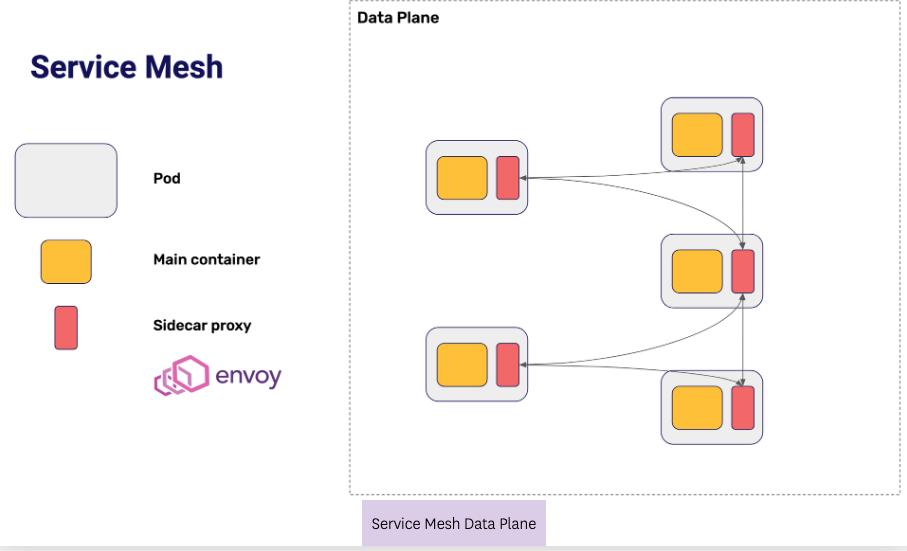
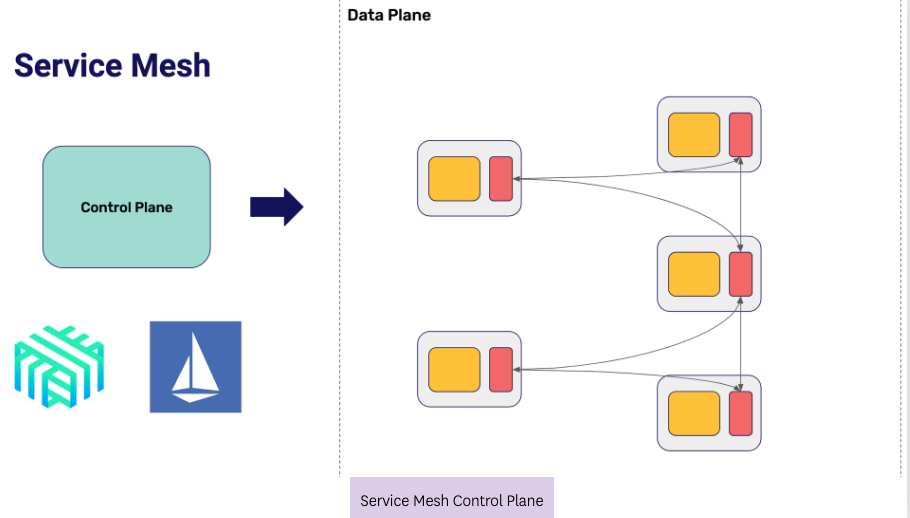
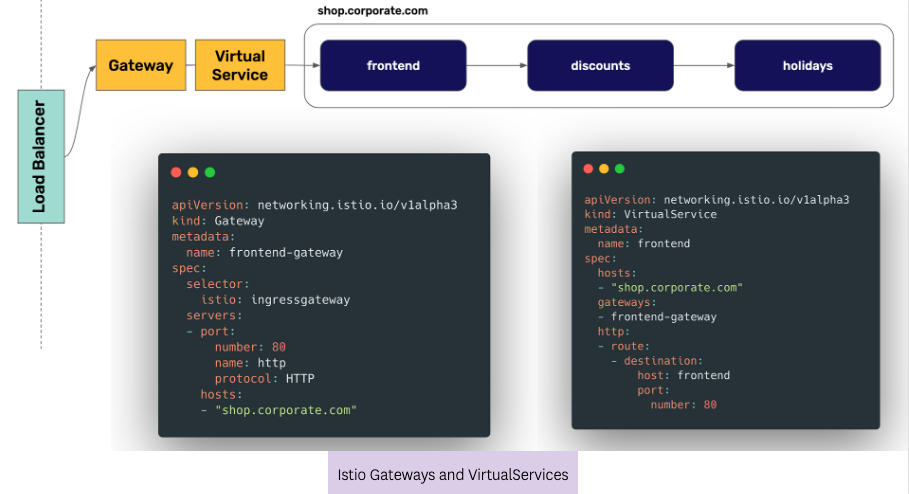
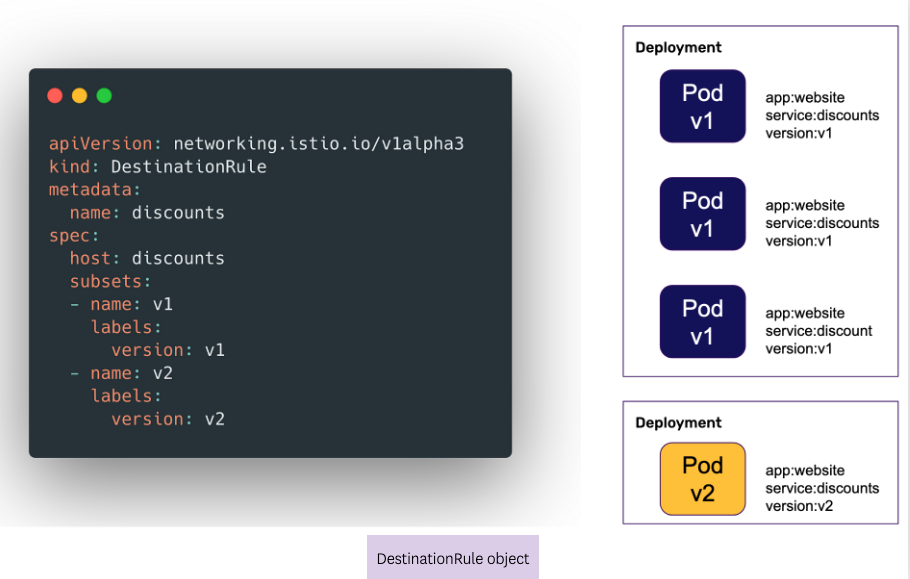
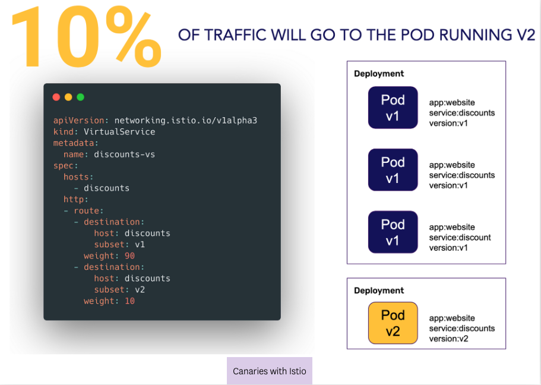

The last way to implement Progressive Delivery in Kubernetes that we will see in this course is through Service Meshes, particularly we will be using Istio in this course. But what are service meshes and why they are a good way to implement Progressive Delivery?

## Service Meshes
Service Meshes have two parts: the data plane and the control plane.

For the data plane, every Pod in your cluster (within the service mesh) will contain a networking proxy (Envoy is a popular solution for this). All communication between Pods will happen through the proxy, and not directly through application code. This allows delegating things like encryption to the service mesh.

The control plane, projects like Istio or Linkerd, improve the usability of the networking proxies by creating a user friendly language to configure the behavior of the proxies. In Kubernetes, this language is usually implemented via Custom Resource Definitions, or CRDs.

As Service Meshes provide a rich language to manage the traffic between Pods, they provide an excellent place to implement Progressive Delivery techniques.

## Progressive Delivery with Istio
The first thing that we will need to do to implement Progressive Delivery in Kubernetes with Istio is to expose our service using Istio Gateway and Istio VirtualService. The combination of these two CRDs provide Istio equivalent to an Ingress object, and they are very similar to this core Kubernetes object.

The Istio Gateway will define the different target URLs for external traffic, and the VirtualService object will map those Gateways to services in the cluster:

To implement Progressive Delivery, we need to tell Istio that there are several different versions of a particular service. This is done in Istio through the DestinationRule object. In the example below we are telling Istio that there are two versions of our discounts service, the first version will be any Pod with the label version=v1, and the second version will be any Pod with the label version=v2 (given that the two other labels for the service, app=website and service=discounts also exist):

Once we have the different versions of the service as DestinationRules, we can define a canary deployment with a VirtualService:

More examples of traffic management using Istio can be found in their official documentation.

In the final lab we will practice exposing a service using Istio Gateway and creating a canary deployment with Istio's traffic management features.

